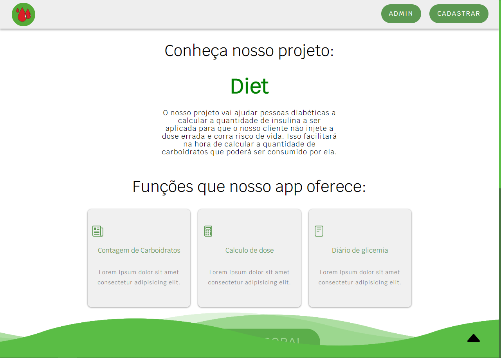

  

<h1 align="center">Diats </h1>

Nossa ideia é criar um site para ajudar as pessoa diabeticas, trazendo noticias, Contagem de Carboidratos, Calculo de dose e Diário de glicemia 

## Nosso site

## Membros
- `Gabriel Althoff -  rm15194`
- Davi Queiroz - rm 15186
- Willian Feng - rm13675
- Oliver Kanai - rm14078
- Joao Gabriel - rm15267
